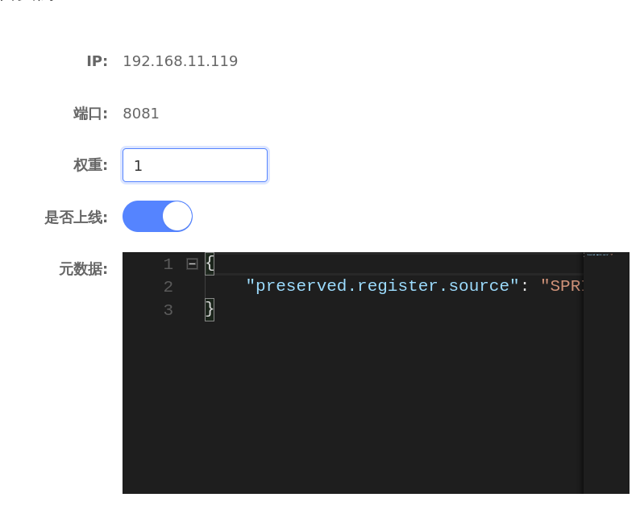
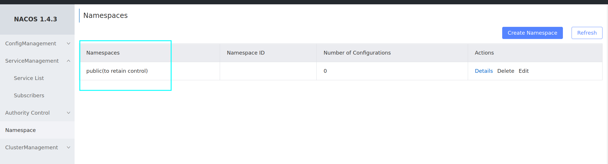
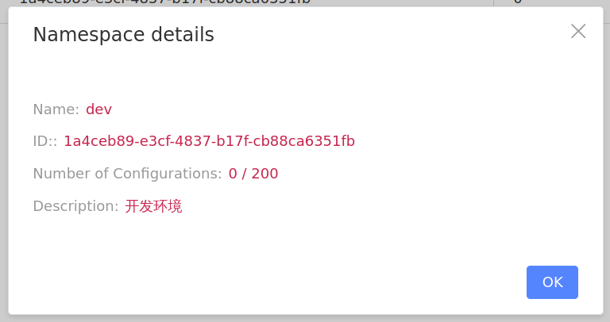

# cloudDemoTwo
这里主要就是关于Nacos的相关知识
## Nacos

### 基础知识

Nacos是阿里巴巴的一个产品，现在国内很流行

1. [github仓库](https://github.com/alibaba/nacos)
2. [快速配置](https://nacos.io/en-us/docs/quick-start.html)
3. 
4. [Spring Cloud Commons](https://spring.io/projects/spring-cloud-commons)

    * `DiscoveryClient` interface
    * `ServiceRegistry` interface
    * Instrumentation for `RestTemplate` to resolve hostnames using `DiscoveryClient`
    * 也就是说不管是Eureka还是Nacos其实都是实现了这几个接口
5. 其实大变化不多，主要是之前引入Eureka依赖现在引入Nacos依赖
6. 之前配置Eureka地址现在配置Nacos地址

    ```yaml
    spring:
      cloud:
        nacos:
          server-addr: localhost:8848
    ```


---

### Nacos服务分级存储模型

这个简单来说就是服务-->集群-->实例

也就是配置容灾，很多个地区的机房里面配置上同一个实例，这些实例组成集群，多个集群组成服务

服务调用应该尽可能的选择本地集群的服务，跨集群调用延迟高，只有本地集群不可以用的时候才会去访问其他地方的集群，
Nacos引入集群这个“概念”就是为了避免跨集群调用

配置集群只需要在application.yml中加入

```yaml
spring:
  cloud:
    nacos:
      discovery:
        cluster-name: HB #指河北
```


也就是分为了三级
一级按照服务分，二级按照集群（地域）分，三级按照实例分

刚刚配置好，此时如果访问`localhost:8080/order/101`那么依然是轮询访问

此时配置负载均衡

```yaml
userServer: #服务的名称
  ribbon:
    NFLoadBalancerRuleClassName: com.alibaba.cloud.nacos.ribbon.NacosRule
```

com.alibaba.cloud.nacos.ribbon.NacosRule的访问特点就是优先访问本地集群，然后在本地集群中随机选择一个实例去使用

如果停掉UserServer1和2那么就去访问3（也就发生了跨集群访问）此时会报一个警告信息⚠

### 设置权重

设置权重如果使用的nacos会很简单直接在后台中编辑就可以了




权重一般情况是0-1,eg设置为0.5就会大大降低被访问的概率，权重设置为0那么就不会在被访问了

#### 关于权重0

如果将权重设置为0,那么之前的访问不会受到影响，依然会得到一个回应，但是后续新的请求将不会在接受

### NameSpace环境隔离

Nacos中服务存储和数据存储的最外层都是一个名为namespace的东西，用来做最外层隔离


不同namespace是相互隔离的

namespace内部还会进行分组group，这个并不是一个强制要配置的，不用也可以的，不使用默认的是DEFAULT_GROUP



关于namespace nacos会默认创建一个叫做public的命名空间，如果不进行配置的话，那么全部的东西都在里面




配置命名空间需要去application.yml中去添加一个namespace的选项后面加上空间ID

```yaml
spring:
  cloud:
    nacos:
      server-addr: localhost:8848
      discovery:
        cluster-name: SH
        namespace: 1a4ceb89-e3cf-4837-b17f-cb88ca6351fb #配置命名空间
```

不再一个命名空间中的实例不能相互访问，也就是不同的namespace之间是不可以见的

### 临时实例


临时实例的意思就是像Eureka一样实例要主动向注册中心发送心跳维持，但是非临时实例的话是Nacos注册中心主动去询问

非临时实例哪怕down了也不会被从列表中剔除，会依然去询问等待他重新恢复，

服务消费者是每30秒拉取pull一次服务者列表，如果这三十秒内有服务挂掉了Eureka就无奈了，但是Nacos采用了pull+push（拉取+推送）的方式，也就是如果Nacos发现服务者挂掉了会立马向消费者推送新的服务者列表

```yaml
spring:
  cloud:
    nacos:
      server-addr: localhost:8848
      discovery:
        cluster-name: SH
        # namespace: 1a4ceb89-e3cf-4837-b17f-cb88ca6351fb
        ephemeral: false #默认是true 设置为false 就会注册为非临时实例
```

